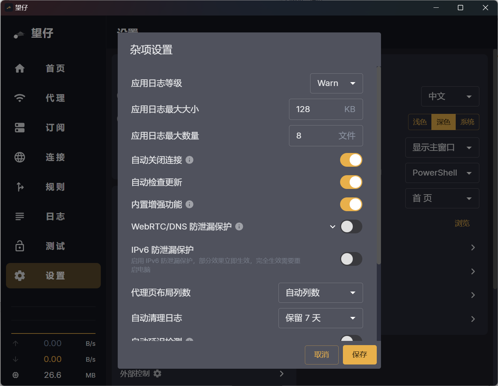
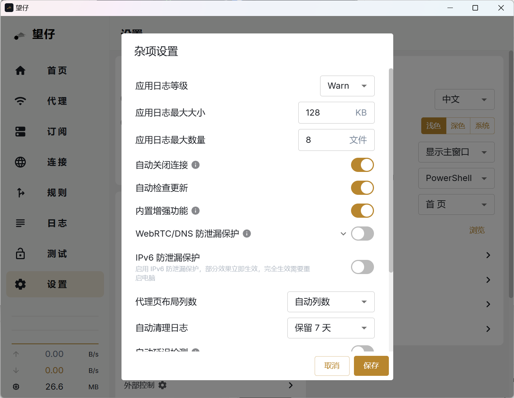

<h1 align="center">
  
  <br>
  望仔 Wangzai
  <br>
</h1>

<h3 align="center">
专注保护隐私的 Clash Meta 客户端<br>
基于 <a href="https://github.com/tauri-apps/tauri">Tauri</a> 与 <a href="https://github.com/MetaCubeX/mihomo">mihomo</a> 内核
</h3>

<p align="center">
  延续自 <a href="https://github.com/clash-verge-rev/clash-verge-rev">Clash Verge Rev</a>，在此基础上强化隐私保护与防泄漏能力。
</p>

## 预览 Preview

| 深色 Dark                          | 浅色 Light                           |
| ---------------------------------- | ------------------------------------ |
|  |  |

## 安装 Install

请前往发布页下载对应安装包：[Release 页面](https://github.com/wlxlyxa/wangzai/releases)

支持 Windows（x64 / x86）、Linux（x64 / arm64）与 macOS 11+（Intel / Apple Silicon）。

## 隐私保护特性（望仔专属）

望仔在常规代理客户端之上，内置一整套防泄漏机制，最大程度避免真实 IP 与流量暴露：

- 🛡️ **DNS 泄漏保护**：检测并阻断系统级 DNS 泄漏，强制 DNS 查询走代理通道，含 DoH 策略检测。
- 🚫 **IPv6 泄漏控制**：一键阻断 IPv6，防止 IPv6 直连绕过代理、泄露真实地址。
- 🕵️ **WebRTC 泄漏防护**：禁用浏览器 WebRTC，阻止本地 / 内网 IP 被网页探测。
- 🔌 **杀死开关 Kill Switch**：代理异常或断连时立即阻断全部出站流量，杜绝"掉线即裸连"的泄漏窗口。
- 🐕 **看门狗 Watchdog**：实时监控内核健康，任一异常立即触发杀死开关拦截流量并尝试自动重启内核，恢复正常后自动解除拦截。
- 🧱 **TUN 防火墙放行**：为虚拟网卡自动配置防火墙规则，保障 TUN 模式稳定不漏流。

## 基础功能

- 基于高性能 **Rust + Tauri 2** 框架。
- 内置 [Clash.Meta (mihomo)](https://github.com/MetaCubeX/mihomo) 内核，支持切换 `Alpha` 版本内核。
- 简洁美观的界面，支持自定义主题色、代理组 / 托盘图标与 `CSS Injection`。
- 配置文件管理与增强（Merge / Script），配置语法提示。
- 系统代理与守卫、`TUN（虚拟网卡）` 模式。
- 可视化节点与规则编辑。
- WebDav 配置备份与同步。

## 常见问题 FAQ

如有使用问题，欢迎在 [Issues](https://github.com/wlxlyxa/wangzai/issues) 反馈。

## 开发 Development

安装好 **Tauri** 所需前置依赖后，执行以下命令启动开发环境：

```shell
pnpm i
pnpm run prebuild
pnpm dev
