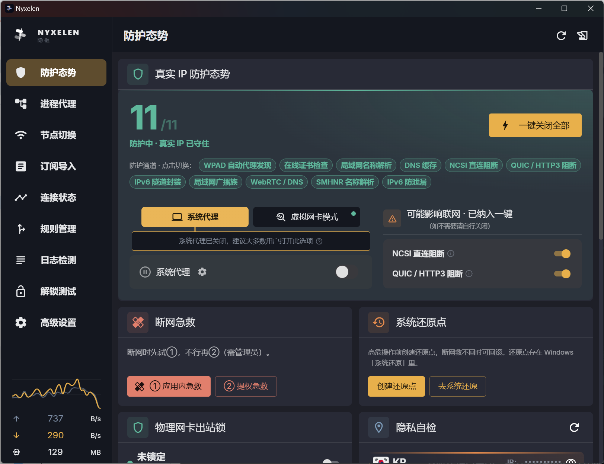
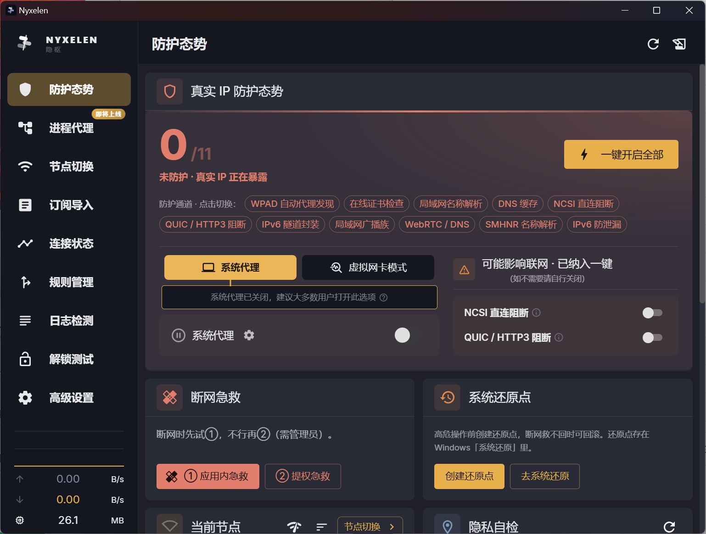

# NYXELEN · 隐枢

> 让连接，隐于无形。

Nyxelen（隐枢）是一款基于 [clash-verge-rev](https://github.com/clash-verge-rev/clash-verge-rev) / [mihomo](https://github.com/MetaCubeX/mihomo) 内核的桌面代理客户端。它不做"又一个套壳"——而是在成熟的代理内核之上，把**隐私防护**做成一等公民：一屏看清你的真实 IP 是否暴露，一键堵住那些悄悄泄露你的缝隙。

「隐枢」二字，是它的内核隐喻：**隐**，是把你藏进夜里；**枢**，是那道贯穿始终、守住一切的轴。

## 它能做什么

🛡 **防护态势** —— 首页即战场态势。11 项真实 IP 防护通道，一键全开或逐项点切，开没开、防没防住，一眼分明。

🔒 **防泄漏套件** —— 把那些"代理开着却仍在泄露"的隐蔽通道逐个堵上：

- WebRTC 防泄漏（Chrome / Edge 策略级拦截
- DoH 加密 DNS 阻断 + 关闭 Windows 智能多宿主名称解析（SMHNR）
- IPv6 隧道封装与防泄漏
- NCSI 直连阻断、QUIC / HTTP3 阻断
- WPAD 自动代理发现、在线证书检查、局域网名称解析 / 广播族 等

🔍 **隐私自检** —— 出口 IP、自治域、服务商、代理标记、本机与出口时区一致性，实时校验，泄露无处藏。

🩹 **断网急救** —— 应用内急救 + 提权急救两步兜底；高危操作前一键创建系统还原点，救不回还能滚回去。

🧩 **进程代理** —— 让每个程序走自己想走的路（即将上线）。

## 防护态势 · 一屏掌握

同一块面板的两种状态——开与关，一眼看清你的真实 IP 守没守住：

| 🛡 全开 · 真实 IP 已守住 | ⚠ 全关 · 真实 IP 正在暴露 |
|:---:|:---:|
|  |  |
| 11 项防护通道全绿，一键开启 | 0 项开启，红色警示真实 IP 暴露 |

## 视觉

**铰链知节** mark：三节错落的胶囊，被一道金轴贯穿——蓝紫是夜里流转的数据，金轴是守望它的那道力。深底单色版用于系统托盘，缩放至 16px 仍可辨认。

左上角 **NYXELEN / 隐枢** 双行字标，悬停时字距微张、染上金芒，像一次呼吸。

## 下载与安装

前往 [Releases](https://github.com/wlxlyxa/nyxelen/releases) 或 [nyxelen.com](https://nyxelen.com) 下载 Windows 安装包（`Nyxelen_*_x64-setup.exe`），双击安装即可使用。

> 已安装旧版「望仔（WangZai）」的用户：直接安装 Nyxelen 即可。订阅与配置随数据目录保留，无需重新配置。

## 致上游与协议

Nyxelen 基于 [clash-verge-rev](https://github.com/clash-verge-rev/clash-verge-rev) 二次开发，内核为 [mihomo](https://github.com/MetaCubeX/mihomo)，遵循 **GPL-3.0** 协议。

- 本项目保留原始版权与协议声明，并注明基于 clash-verge-rev 二次开发；
- 衍生分发保持源码开放；
- 向 clash-verge-rev 与 mihomo 的维护者致谢——没有他们，就没有 Nyxelen 站立的地基。

## 隐私观

Nyxelen 不收集、不上报你的任何连接数据。所有防护与自检均在你本机完成。它存在的唯一目的，是让你的流量，只走你想让它走的路。
